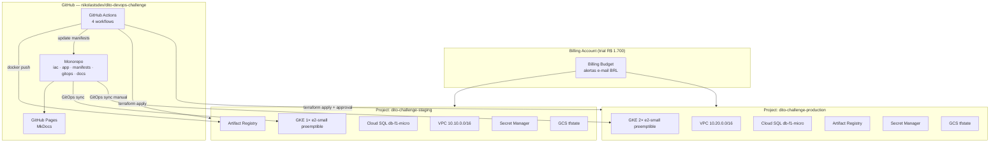
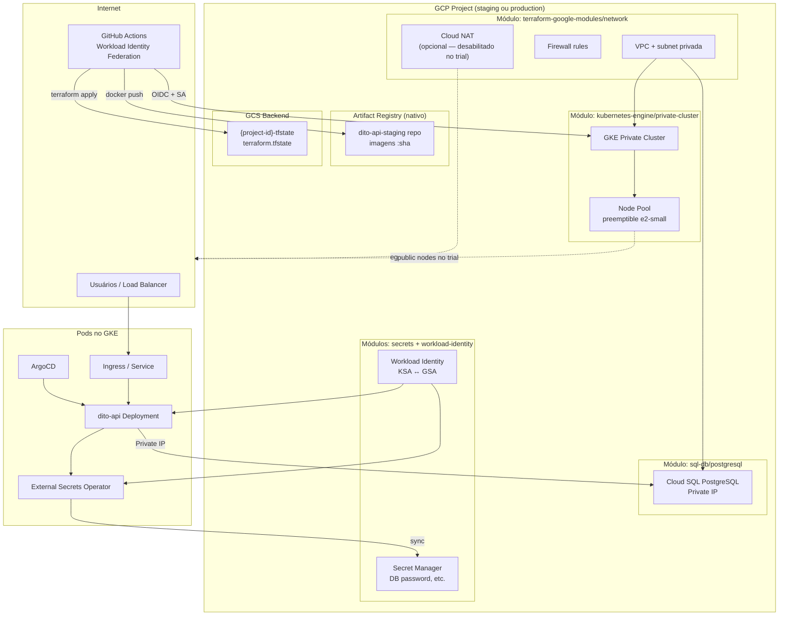
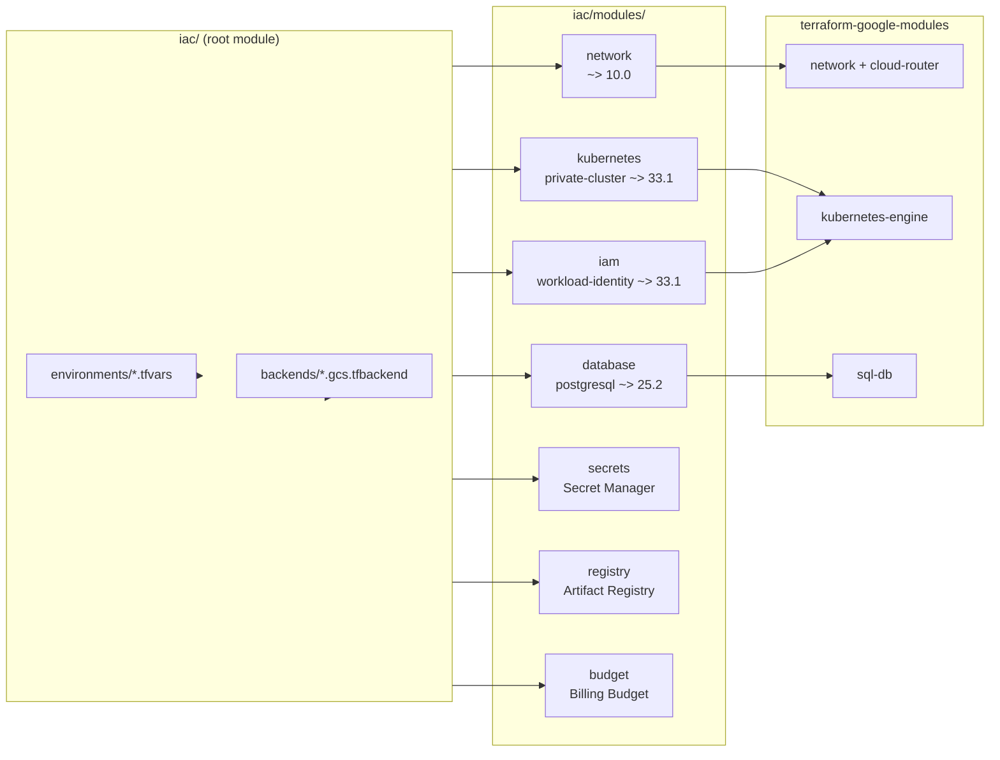
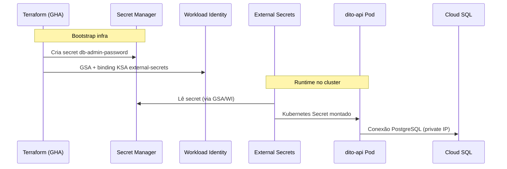
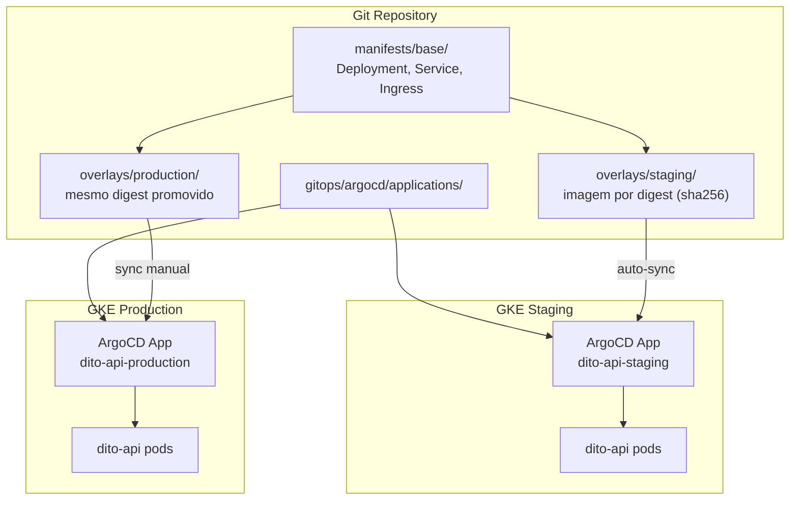
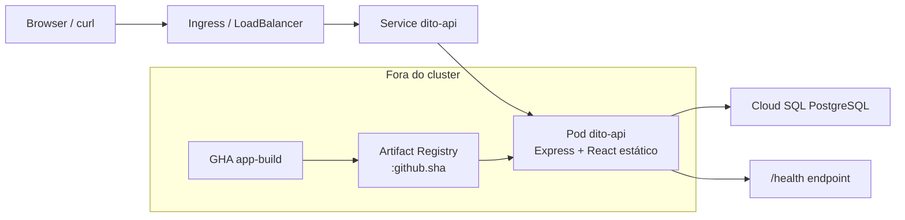
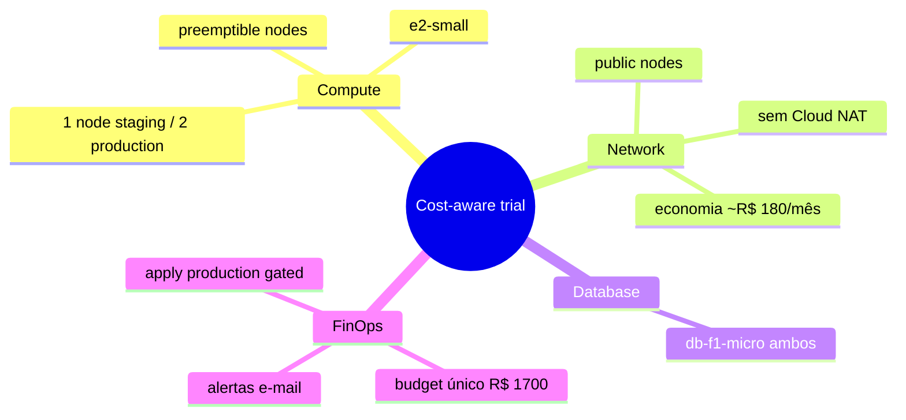

# Diagramas de arquitetura

Documentação visual da arquitetura escolhida para o Desafio DevOps III: **dois GCP Projects** isolados, **Terraform com módulos oficiais Google**, **GKE + Cloud SQL + Secret Manager**, **GitOps com ArgoCD** e **CI/CD via GitHub Actions**.

---

## 1. Visão macro — multi-project

Dois projects GCP na **mesma billing account** (créditos trial R$ 1.700 / 90 dias), região **southamerica-east1 (São Paulo)**.

| Aspecto | Staging | Production |
|---------|---------|------------|
| Project ID | `dito-challenge-staging` | `dito-challenge-production` |
| VPC CIDR | `10.10.0.0/16` | `10.20.0.0/16` |
| GKE nodes | 1× e2-small preemptible | 2× e2-small preemptible |
| Cloud NAT | Desabilitado (`use_public_nodes=true`) | Desabilitado (trial) |
| Cloud SQL | db-f1-micro | db-f1-micro |
| Budget | Criado aqui (`enable_budget=true`) | Não recria (`enable_budget=false`) |
| Terraform apply (trial) | Automático no merge `main` | Com gate `environment: production` |

---

## 2. Topologia por project (GCP)

Cada project é provisionado de forma **independente** pelo Terraform, com state remoto isolado.

---

## 3. Mapeamento Terraform → módulos oficiais

Wrappers locais em `iac/modules/` encapsulam módulos **`terraform-google-modules`**.

| Wrapper local | Módulo upstream | Recursos principais |
|---------------|-----------------|---------------------|
| `modules/network/` | `network` + `cloud-router` | VPC, subnet, NAT (opcional) |
| `modules/kubernetes/` | `private-cluster` | GKE, node pool, IP aliases |
| `modules/database/` | `postgresql` | Cloud SQL, usuário, DB |
| `modules/iam/` | `workload-identity` | GSA + binding KSA |
| `modules/secrets/` | nativo | Secret Manager versions |
| `modules/registry/` | nativo | Docker repo Artifact Registry |
| `modules/budget/` | nativo | Budget BRL + alertas |

**Providers:** `google` / `google-beta` **6.50.0** (compatibilidade GKE v33 + cloud-router v6).

---

## 4. Fluxo de secrets e identidade

Credenciais **nunca** ficam no Git. Pipeline injeta senha DB; cluster consome via External Secrets.

| Origem | Secret | Destino |
|--------|--------|---------|
| GitHub Secret `TF_VAR_DB_ADMIN_PASSWORD` | Senha admin DB | Terraform → Secret Manager |
| Secret Manager | `db-admin-password` | ExternalSecret → K8s Secret |
| Workload Identity | GSA `external-secrets@...` | ESO pod autentica no GCP |
| GitHub OIDC | WIF Provider | GHA autentica sem JSON key |

---

## 5. GitOps — fonte da verdade

Um único repositório; ambientes separados por **overlays Kustomize**.

---

## 6. Fluxo de dados da aplicação

---

## 7. Decisões de custo (trial)

---

## Referências

- [Visão geral](overview.md)
- [Rede](network.md)
- [Fluxo GitOps](gitops-flow.md)
- [Diagramas de pipeline](../ci-cd/pipeline-diagrams.md)
- [ADR 007 — Módulos Terraform oficiais](../decisions/007-official-terraform-modules.md)
