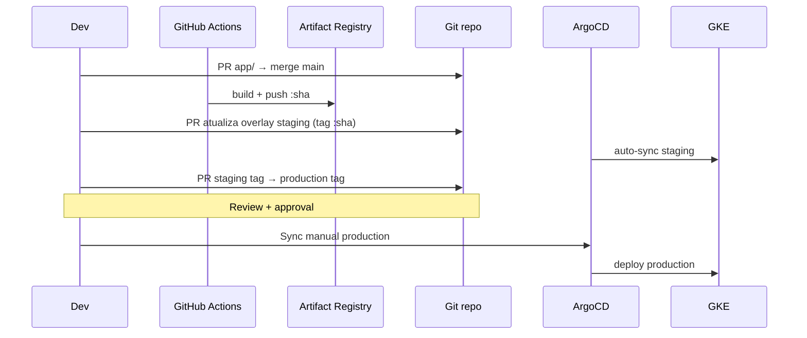

# Fluxo GitOps

## Estratégia: overlays Kustomize

Promoção **staging → production** via **Pull Request** que altera apenas o overlay de production:

```
manifests/
├── base/                    # Comum a todos os ambientes
└── overlays/
    ├── staging/             # imagem por digest (sha256) — deploy automático no push para main
    └── production/          # mesmo digest promovido de staging — promoção deliberada
```

### Por que diretórios e não branches?

| Abordagem | Prós | Contras |
|-----------|------|---------|
| **Diretórios (escolhida)** | Diff claro no PR; um histórico linear; padrão Kustomize | Repo maior |
| Branches por ambiente | Isolamento forte | Drift entre branches; merges complexos |
| Helm values por env | Templates reutilizáveis | Mais abstração para escopo do desafio |

## ArgoCD Applications

| App | Path | Sync |
|-----|------|------|
| `dito-api-staging` | `manifests/overlays/staging` | **Automático** (`automated: prune, selfHeal`) |
| `dito-api-production` | `manifests/overlays/production` | **Manual** (sem `automated`) |

Arquivos em [`gitops/argocd/applications/`](../../gitops/argocd/applications/).

## Fluxo completo



> Fluxo detalhado com todos os pipelines: [Diagramas de pipeline](../ci-cd/pipeline-diagrams.md).

## Build Once, Deploy Everywhere

A mesma imagem (`:sha`) é promovida alterando apenas a tag no overlay — padrão já utilizado em produção no projeto NDD Cargo (ArgoCD + Kustomize).
