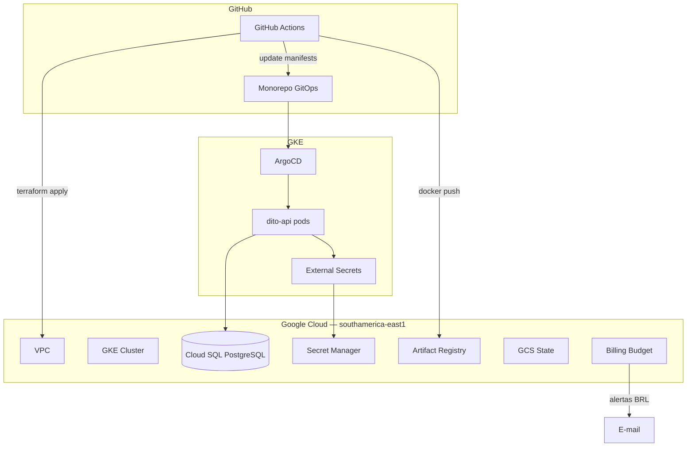

# Visão geral da arquitetura

## Diagrama resumido

> **Diagramas completos:** [Diagramas de arquitetura](diagrams.md) (multi-project, módulos Terraform, secrets, GitOps) e [Diagramas de pipeline](../ci-cd/pipeline-diagrams.md).

## Componentes

| Camada | GCP | Responsabilidade |
|--------|-----|------------------|
| Rede | VPC (módulo `network`) | Subnet privada, NAT opcional |
| Compute | GKE (`private-cluster`) | Containers |
| Dados | Cloud SQL (`postgresql`) | PostgreSQL gerenciado |
| Secrets | Secret Manager + Workload Identity | Credenciais seguras |
| Registry | Artifact Registry | Imagens Docker |
| State | GCS | Terraform remote state por project |
| FinOps | Billing Budget | Alertas R$ 1.700 (billing account) |

## Ambientes (trial cost-aware)

| | staging | production |
|---|---------|------------|
| Project | `dito-challenge-staging` | `dito-challenge-production` |
| Nodes | 1× e2-small preemptible | 2× e2-small preemptible |
| NAT | Desabilitado (public nodes) | Desabilitado (trial) |
| SQL | db-f1-micro | db-f1-micro |
| Custo ~ | R$ 80–150/mês | R$ 120–200/mês |
| Terraform apply | Automático (`main`) | Gate `environment: production` |
