# Diagramas de pipeline CI/CD

Visão completa dos **4 workflows GitHub Actions**, gates de ambiente, promoção GitOps e integração com GCP.

---

## 1. Panorama geral

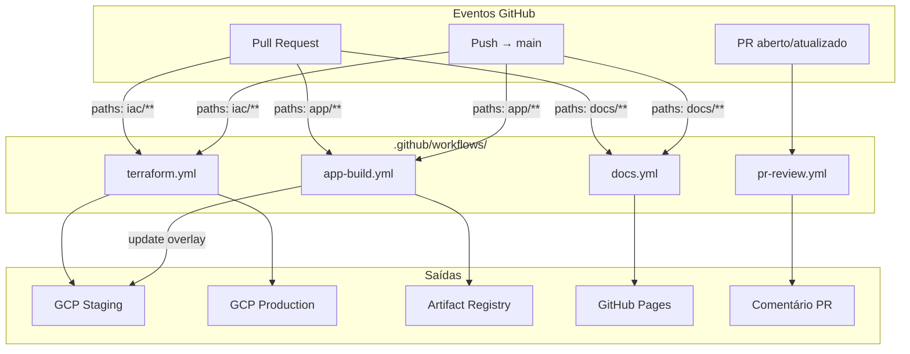

| Workflow | Arquivo | Trigger (paths) | Merge `main` |
|----------|---------|-----------------|--------------|
| Terraform | `terraform.yml` | `iac/**`, `scripts/**` | apply staging → apply production |
| App Build | `app-build.yml` | `app/**` | push imagem `:sha` |
| Documentation | `docs.yml` | `docs/**`, `mkdocs.yml` | deploy GitHub Pages |
| PR Review | `pr-review.yml` | qualquer PR | comentário checklist |

---

## 2. Pipeline Terraform (`terraform.yml`)

### 2.1 Pull Request — plan only

Nunca aplica infra em PR. Valida sintaxe e gera planos para **ambos** os projects (se vars configuradas).

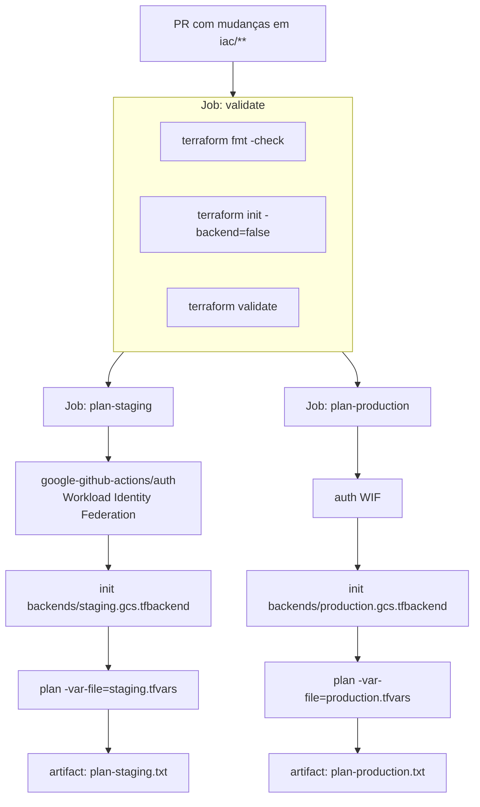

**Condições:**

- `plan-staging`: roda se `vars.GCP_PROJECT_ID_STAGING != ''`
- `plan-production`: roda se `vars.GCP_PROJECT_ID_PRODUCTION != ''`
- Secret: `TF_VAR_db_admin_password` via `secrets.TF_VAR_DB_ADMIN_PASSWORD`

### 2.2 Push `main` — apply com gates

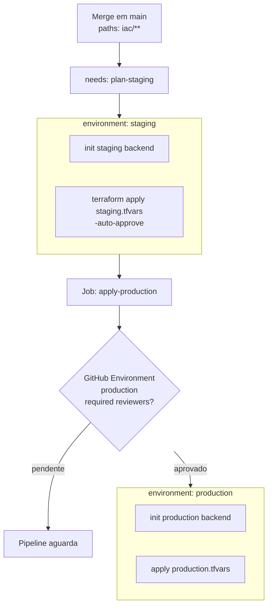

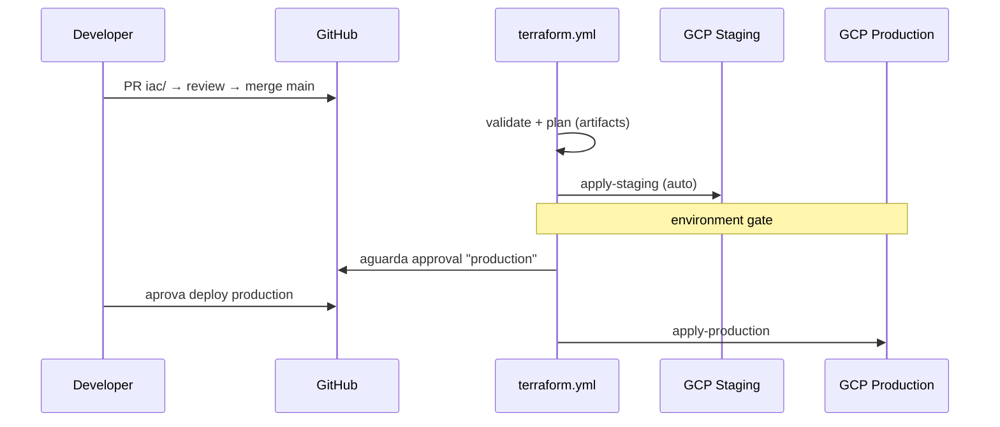

**Autenticação GCP (todos os jobs apply/plan):**

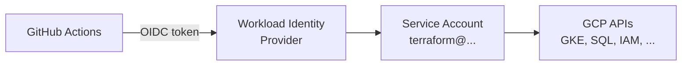

Secrets necessários:

- `GCP_WORKLOAD_IDENTITY_PROVIDER`
- `GCP_SERVICE_ACCOUNT`
- `TF_VAR_DB_ADMIN_PASSWORD`

---

## 3. Pipeline App (`app-build.yml`)

Build, scan e push da imagem Docker para **Artifact Registry** (project staging).

### 3.1 Pull Request

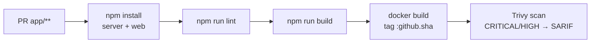

### 3.2 Push `main`

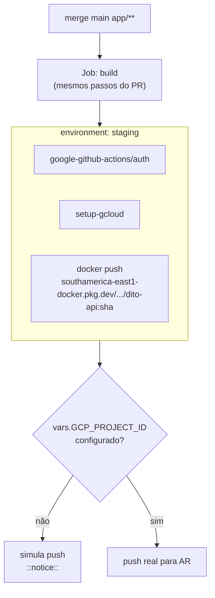

**Imagem produzida:**

```
southamerica-east1-docker.pkg.dev/{GCP_PROJECT_ID}/dito-api-staging/dito-api:{github.sha}
```

---

## 4. Pipeline Docs (`docs.yml`)

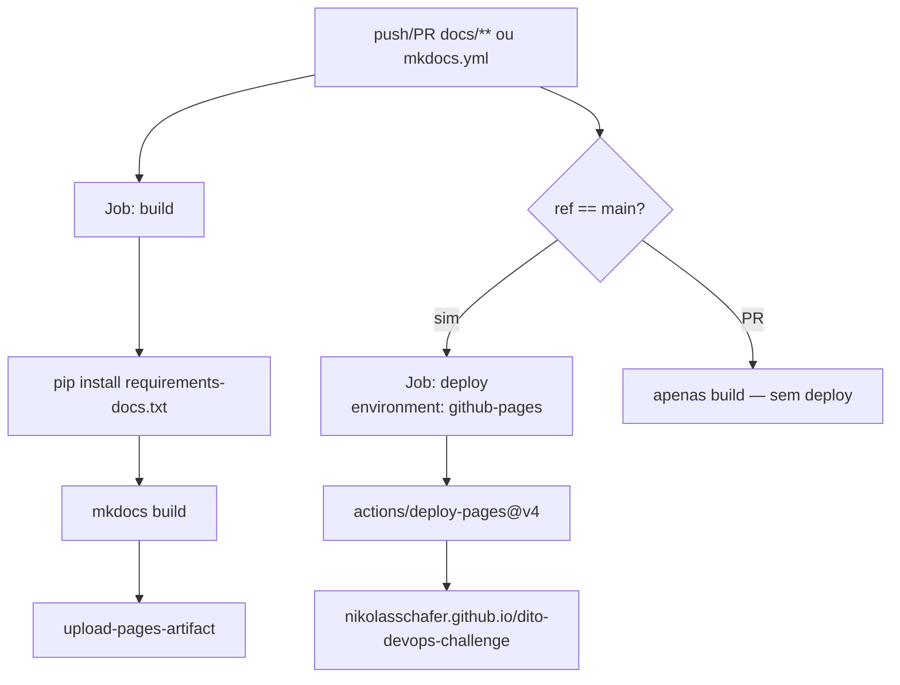

**Concurrency:** `group: pages` com `cancel-in-progress: true` — evita deploys paralelos.

---

## 5. Pipeline PR Review (`pr-review.yml`)

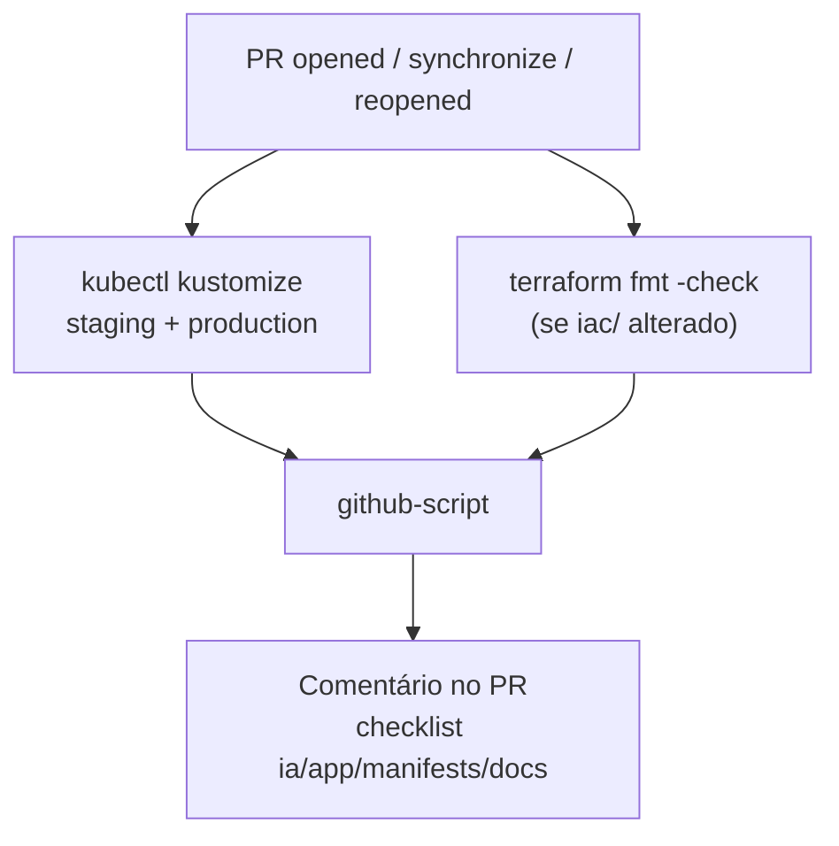

Checklist automático:

- ✅/⬜ Alterações em `iac/`, `app/`, `manifests/`, `docs/`
- Recomendações: kubeconform, kube-score, conftest
- Link para [validação de manifests](manifests-validation.md)

---

## 6. Fluxo end-to-end — da feature ao production

Integração **CI (build)** + **GitOps (deploy)** + **IaC (infra)**.

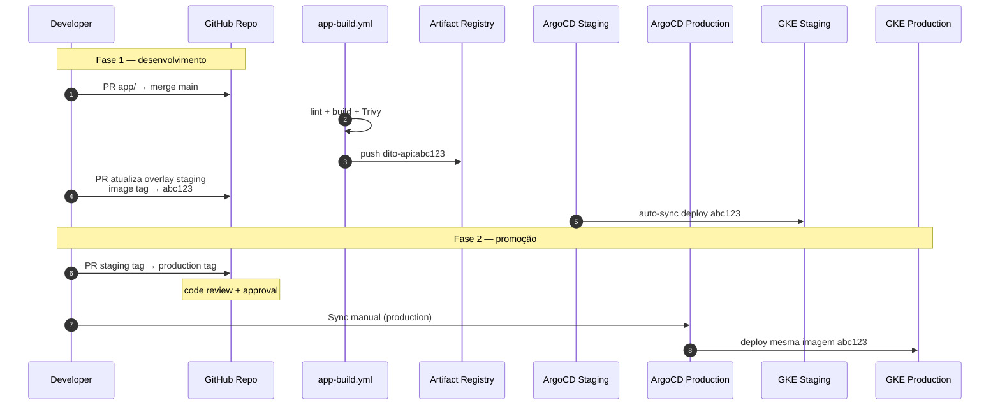

### Build Once, Deploy Everywhere

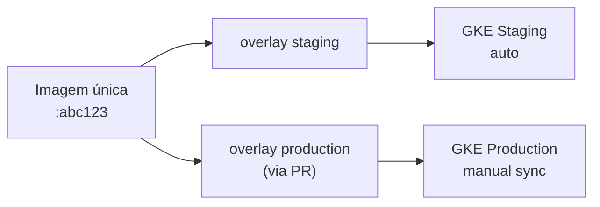

---

## 7. Matriz de gates e ambientes GitHub

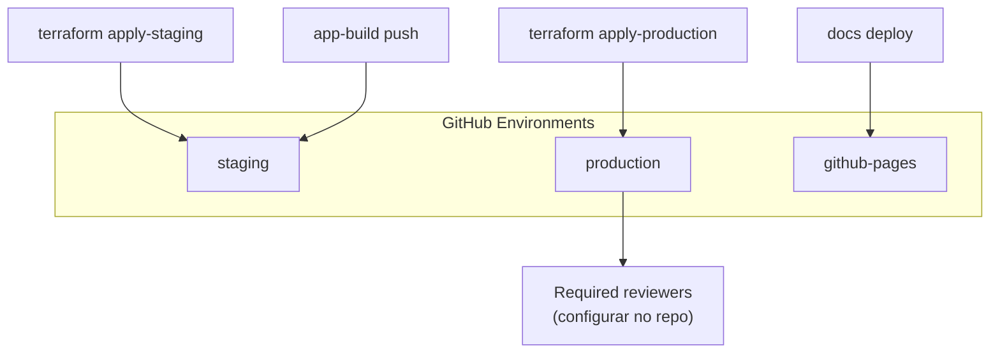

| Job | Environment | Proteção recomendada |
|-----|-------------|----------------------|
| `apply-staging` | `staging` | Opcional |
| `apply-production` | `production` | **Required reviewers** |
| `push` (app) | `staging` | Opcional |
| `deploy` (docs) | `github-pages` | Padrão GitHub Pages |

---

## 8. Ordem típica de bootstrap

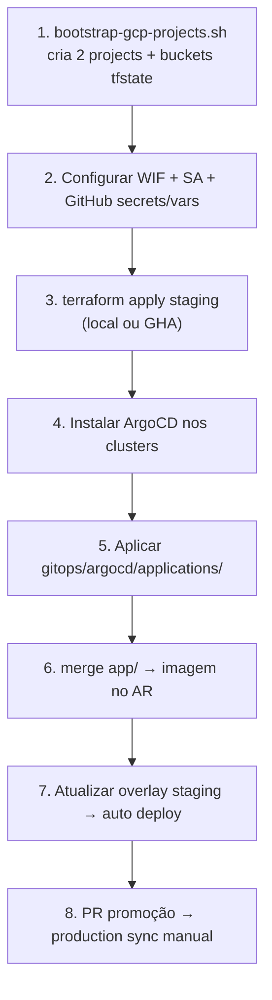

---

## Referências

- [Workflows (detalhe textual)](workflows.md)
- [Estratégia de promoção](promotion-strategy.md)
- [Fluxo GitOps](../architecture/gitops-flow.md)
- [Diagramas de arquitetura](../architecture/diagrams.md)
- [Setup GitHub](../runbook/github-setup.md)
