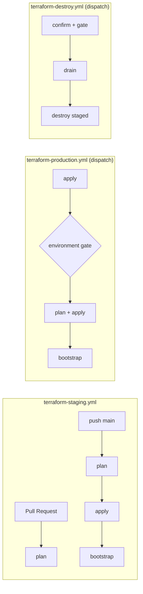

# Workflows CI/CD

> **Diagramas completos:** [Diagramas de pipeline](pipeline-diagrams.md) — visão macro, Terraform PR vs apply, app-build, docs, promoção end-to-end.

## Visão geral

| Workflow | Trigger | Jobs |
|----------|---------|------|
| [`terraform-staging.yml`](../../.github/workflows/terraform-staging.yml) | PR/push `iac/**` + dispatch | validate → plan → apply → bootstrap (apply só em main/dispatch) |
| [`terraform-production.yml`](../../.github/workflows/terraform-production.yml) | dispatch (gated) | validate → plan \| apply → bootstrap |
| [`terraform-destroy.yml`](../../.github/workflows/terraform-destroy.yml) | dispatch (gated + confirm) | drain → destroy staged (staging \| production) |
| [`app-build.yml`](../../.github/workflows/app-build.yml) | PR/push `app/**` | build + Trivy → push por digest → `kustomize edit set image` staging |
| [`app-promote.yml`](../../.github/workflows/app-promote.yml) | dispatch (gated) | copia digest staging→production → `kustomize edit set image` |
| [`docs.yml`](../../.github/workflows/docs.yml) | push `docs/**` | MkDocs build → GitHub Pages |
| [`pr-review.yml`](../../.github/workflows/pr-review.yml) | PR aberto | checklist automatizado |

## Terraform pipelines (separados por ciclo de vida)

- **staging:** PR = só plan; push em `main` = plan → apply → bootstrap (automático)
- **production:** sempre manual (`workflow_dispatch`), com `environment: production` (approval). Uma única aprovação por execução
- **destroy:** isolado, exige digitar o nome do ambiente + approval gate

## App pipeline

1. `npm install` + lint TypeScript
2. `npm run build` (React + Express)
3. `docker build` → tag `:github.sha`
4. Trivy scan (CRITICAL/HIGH)
5. Push Artifact Registry (`southamerica-east1-docker.pkg.dev/.../dito-api-staging/dito-api`)

## Gestão de secrets

- Credenciais via GitHub Secrets — nunca hardcoded
- Workflows usam `secrets.*` sem echo
- `TF_VAR_db_admin_password` injetado como env var
- GCP auth via Workload Identity Federation (sem JSON key)

## Manifests (`manifests/`)

Conforme enunciado: **descrever** validação, não implementar workflow dedicado.

Ver [Validação de Manifests](manifests-validation.md).
