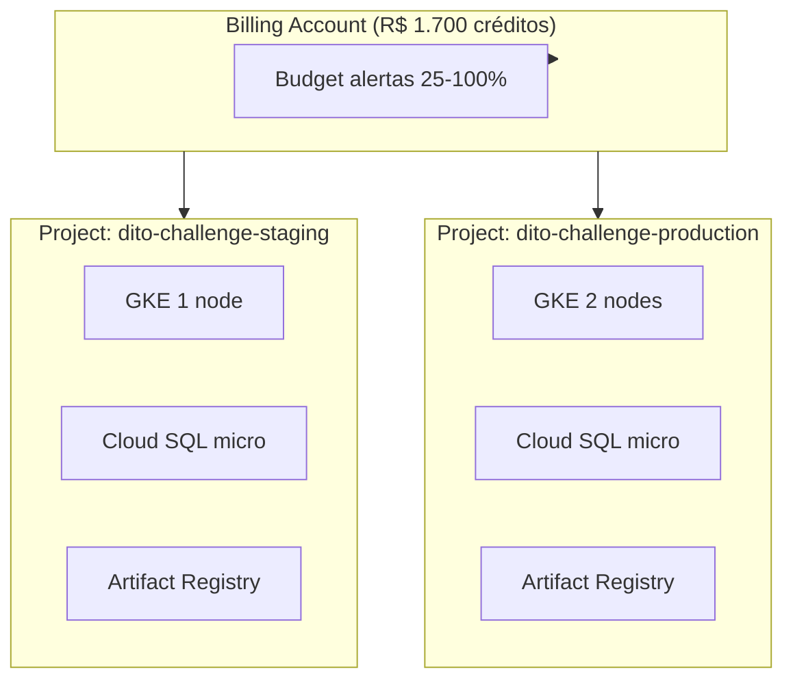

# Dois ambientes, dois GCP Projects

Estratégia para simular **staging + production** completos usando os **R$ 1.700** de créditos trial.

## Por que 2 Projects?

| Benefício | Descrição |
|-----------|-----------|
| **Isolamento real** | Quotas, IAM, rede e billing separados por project |
| **Fluxo GitOps fiel** | Staging auto-sync → PR → production manual |
| **Igual prod real** | Padrão Dito/GCP: 1 project por ambiente |
| **Mesmos créditos** | Billing account única — créditos cobrem **ambos** |



## Nomenclatura

| Ambiente | GCP Project ID | State bucket |
|----------|----------------|--------------|
| staging | `dito-challenge-staging` | `dito-challenge-staging-tfstate` |
| production | `dito-challenge-production` | `dito-challenge-production-tfstate` |

## Custo estimado (2 projects, trial profile)

| Project | Recursos | ~R$/mês |
|---------|----------|---------|
| staging | 1× e2-small preempt, db-f1-micro, sem NAT | 140–230 |
| production | 2× e2-small preempt, db-f1-micro, sem NAT | 220–350 |
| **Total** | | **360–580** |

```
R$ 1.700 ÷ R$ 470 (média) ≈ 3,6 meses com AMBOS ligados 24/7
Trial 90 dias → ~R$ 1.410 estimado → cabe nos créditos ✅
```

!!! tip "Margem de segurança"
    Budget único de R$ 1.700 na billing account (criado no apply staging).
    Alertas em 25%, 50%, 75%, 90%, 100%.

## Bootstrap (criar os 2 projects)

```bash
export GCP_BILLING_ACCOUNT_ID="012345-678901-ABCDEF"
./scripts/bootstrap-gcp-projects.sh
```

O script:
1. Cria `dito-challenge-staging` e `dito-challenge-production`
2. Vincula billing (créditos trial)
3. Habilita APIs necessárias
4. Cria buckets GCS para Terraform state

## Terraform apply (ordem)

```bash
export TF_VAR_db_admin_password='SuaSenhaForte123!'

# 1. Staging (+ budget único R$ 1.700)
./scripts/tf-apply.sh staging plan
./scripts/tf-apply.sh staging apply

# 2. Production (budget já existe — enable_budget=false)
./scripts/tf-apply.sh production plan
./scripts/tf-apply.sh production apply
```

## GitOps com 2 clusters

| Cluster | Project | ArgoCD overlay | Sync |
|---------|---------|----------------|------|
| GKE staging | dito-challenge-staging | `manifests/overlays/staging` | Automático |
| GKE production | dito-challenge-production | `manifests/overlays/production` | Manual |

Instale ArgoCD em **cada** cluster apontando para o mesmo repo GitHub, paths diferentes.

## Painel de custos (2 projects)

Billing → **Reports** → Group by **Project**

Você verá:
- `dito-challenge-staging` — quanto staging consome
- `dito-challenge-production` — quanto production consome
- **Total** — vs créditos R$ 1.700

## Destroy (fim do desafio)

```bash
./scripts/tf-apply.sh production destroy
./scripts/tf-apply.sh staging destroy

gcloud projects delete dito-challenge-production --quiet
gcloud projects delete dito-challenge-staging --quiet
```
